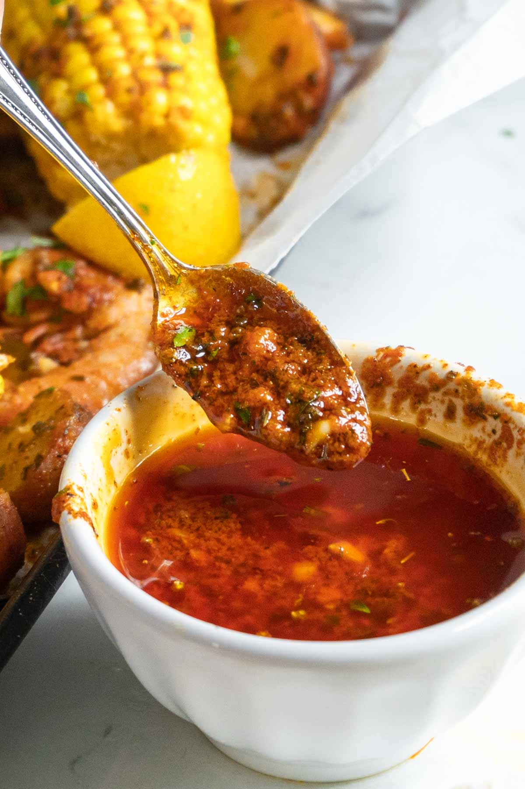

# Cajun Butter

## Ingredients

### Homemade Cajun Spice Mix
- 3 Tablespoons smoked paprika
- 1 Tablespoon onion powder
- 1 Tablespoon garlic powder
- 2 teaspoon kosher salt
- 1 teaspoon ground white pepper
- 1 teaspoon ground mustard
- 1 teaspoon dried oregano
- 1 teaspoon dried thyme
- 1 teaspoon cayenne pepper
- 1/2 teaspoon dried basil

Mix all ingredients together. Note this recipe makes more than needed for the butter.

### For the butter
- 1 stick butter divided
- 4 cloves garlic minced or grated
- 1 Tablespoon lemon juice
- 2 Tablespoons Cajun seasoning homemade or storebought
- 1 Tablespoon fresh parsley minced

## Preparation
- Melt 1 tablespoon of the butter in a small saucepan over low heat. Add the garlic and cook for 1 minute.
- Add the remaining butter, parsley, lemon juice, and cajun seasoning. Whisk to combine then cook for five minutes.