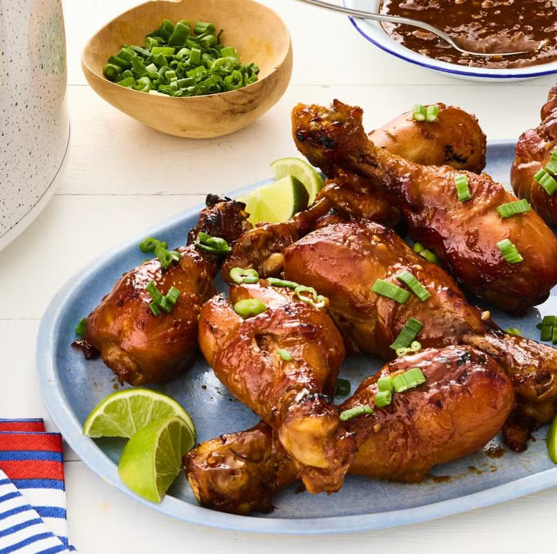

# Slow Cooker Chicken Drumsticks

## Ingredients
- 1/2 cup honey
- 1/2 cup low-sodium soy sauce
- 1 Tbsp. minced fresh ginger
- Juice of 1 lime, plus wedges for serving
- 4 garlic cloves, minced 
- 3 scallions, thinly sliced, white and green parts separated
- Pinch of red pepper flakes (optional)
- 8 skin-on chicken drumsticks (about 2 1/2 pounds total)
- 1 tsp. kosher salt
- 2 Tbsp. cornstarch
- Cooking spray
- White rice, for serving

## Preparation
- Whisk together the honey, soy sauce, ginger, lime juice, garlic, scallion whites, and red pepper flakes in a medium bowl. Place the chicken in a 6-quart slow cooker, season with the salt, and pour the sauce on top. Cover and cook until the chicken is fork-tender and a thermometer inserted into the meat registers 165˚F, 4½ to 5 hours on low or 2½ to 3 hours on high.
- Transfer the chicken to a plate. Whisk together the cornstarch and 3 tablespoons water in a small bowl. Add the cornstarch slurry to the slow cooker and stir until incorporated. Return the chicken to the slow cooker, cover, and cook on high until the sauce is thickened, 20 to 30 minutes.
- Preheat the broiler. Line a baking sheet with foil and spray with cooking spray. Transfer the chicken to the baking sheet and brush with some of the sauce from the slow cooker. Broil, turning once, until the skin is caramelized and charred in spots, about 5 minutes.
- Transfer the chicken to a platter and sprinkle with the scallion greens. Serve with rice, lime wedges, and the remaining sauce.