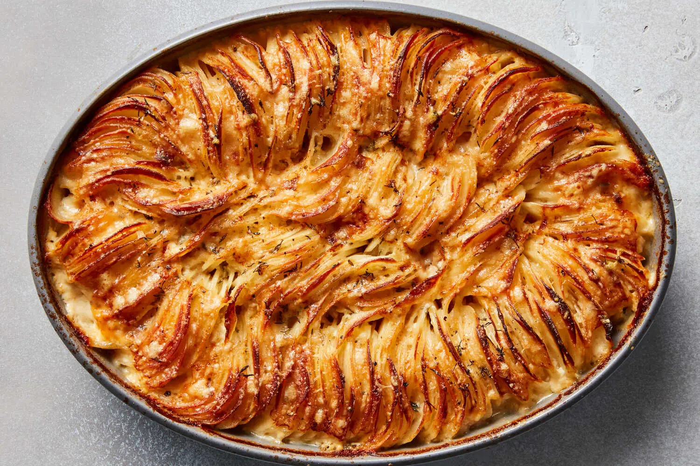

# Creamy Hasselblad Potato Gratin

## Ingredients
- 3 ounces finely grated Gruyere or comte cheese
- 2 ounces finely grated Parmigiano-Reggiano
- 2 cups heavy cream
- 2 medium cloves garlic, minced
- 1 tablespoon fresh thyme leaves, roughly chopped
- Sald and Pepper
- 4 1/2 pounds russet potatoes, peeled and sliced 1/8 inch thick (7-8 potatoes)
- 2 tablespoons unsalted butter

## Preparation
- Adjust oven rack to middle position and heat oven to 400 degrees. Combine cheeses in a large bowl. Transfer 1/3 of the cheese mixture to a separate bowl and set aside. Add cream, garlic and thyme to cheese mixture. Season generously with salt and pepper. Add potato slices and toss with your hands until every slice is coated with cream mixture, making sure to separate any slides that are sticking together to get the cream mixture in between them.
- Grease a 2-quart casserole dish with butter. Pick up a handful of potatoes, organizing them to a neat stack, and lay them in the casserole dish with their edges aligned vertically. Continue placing potatoes in the dish, working around the perimeter and into the center until all potatoes have been added. The potatoes should be tightly packed. If necessary, slice an additional potato, coat with cream mixtrure and add to casserole.
- Pour the excess cream/cheese mixture evenly over the potatoes until the mixture comes halfway up the sides of the casserole. You may not need all the excess liquid.
- Cover dish tightly with a foil and transfer to the oven. Base for 30 minutes. Remove foil and continue baking until the top is pale golden brown, about 30 minutes longer. Carefully remove from oven, sprinkle with remaining cheese, and return to oven. Bake until deep golden brown and crisp on top, about 30 minutes longer. Remove from oven, let rest for a few minutes, and serve.